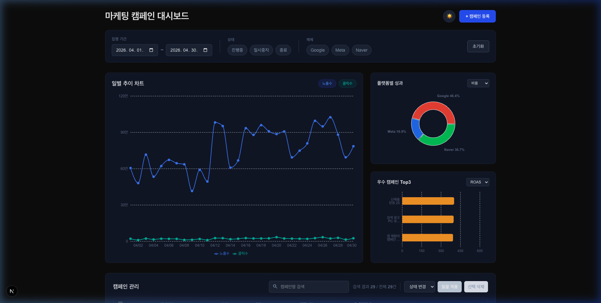
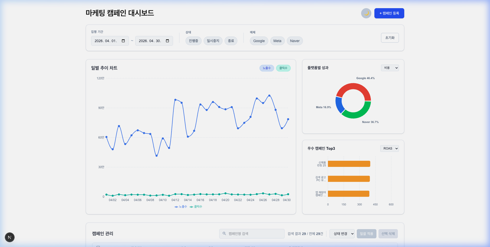
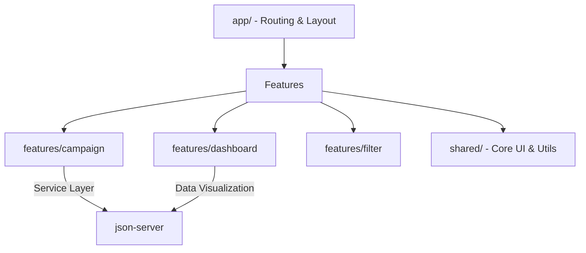

# 🚀 마케팅 캠페인 대시보드 (Marketing Campaign Dashboard)

실시간 마케팅 성과를 시각화하고 캠페인을 효율적으로 관리하기 위한 웹 애플리케이션입니다.
다크 모드와 라이트 모드를 모두 지원하며, 직관적인 데이터 시각화와 일괄 관리 기능을 제공합니다.



---

## 📑 목차

1.  [실행 방법](#-실행-방법)
2.  [🛠 기술 스택](#-기술-스택)
3.  [✨ 주요 기능 및 UI](#-주요-기능-및-ui)
4.  [🏗 아키텍처 및 설계](#-아키텍처-및-설계)
5.  [💡 컴포넌트 설계 전략](#-컴포넌트-설계-전략)

---

## 🏃 실행 방법

```bash
pnpm install
pnpm run dev
```

> [!IMPORTANT]
> `pnpm run dev` 실행 시 `json-server`(3001)와 `Next.js`(3000)가 동시에 실행됩니다.

---

## 🛠 기술 스택

| 분류          | 기술                     | 선택 이유                                                   |
| :------------ | :----------------------- | :---------------------------------------------------------- |
| **Framework** | **Next.js (App Router)** | RSC를 통한 로딩 최적화 및 Parallel Routes 활용              |
| **State**     | **Zustand**              | 전역 필터(`날짜`, `상태`, `매체`)의 효율적인 구독 및 동기화 |
| **Style**     | **Tailwind CSS**         | 유틸리티 우선 스타일링 및 강력한 테마 시스템 활용           |
| **Chart**     | **Recharts**             | 반응형 지원 및 선언적 차트 인터페이스 제공                  |
| **Mock API**  | **JSON Server**          | RESTful API 환경의 신속한 구축 및 흐름 검증                 |

---

## ✨ 주요 기능 및 UI

### 1. 데이터 시각화 대시보드

일별 추이, 매체별 성과, 우수 캠페인을 직관적으로 파악할 수 있습니다.

|                 다크 모드 (Dark)                  |                 라이트 모드 (Light)                 |
| :-----------------------------------------------: | :-------------------------------------------------: |
|  |  |

### 2. 캠페인 관리 테이블

상태 변경, 일괄 삭제, 실시간 검색 등 강력한 관리 기능을 제공합니다.

|                 캠페인 관리 (Dark)                 |                 캠페인 관리 (Light)                  |
| :------------------------------------------------: | :--------------------------------------------------: |
|  |  |

---

## 🏗 아키텍처 및 설계

애플리케이션의 확장성과 유지보수성을 위해 **기능 기반 아키텍처(Feature-based Architecture)**를 채택했습니다.



### 폴더 구조 상세

- **`features/campaign/`**: 캠페인 CRUD 및 상태 관리 전담
- **`features/dashboard/`**: 지표 시각화 및 통계 데이터 전담
- **`features/filter/`**: 전역 필터링 상태(Zustand) 및 비즈니스 로직 전담
- **`shared/`**: 도메인 독립적인 공통 UI, 유틸리티, 전역 타입 공유

---

## 💡 컴포넌트 설계 전략

> [!TIP]
> **관심사의 분리 (SRP)**: UI 컴포넌트는 렌더링에만 집중하고, 로직은 전용 훅으로 추상화했습니다.

- **Parallel Routes**: 차트(`@charts`)와 테이블(`@table`) 영역을 독립적으로 로딩하여 사용자 체감 성능 극대화.
- **Compound Component**: `Table` 컴포넌트를 서브 컴포넌트 조합 방식으로 설계하여 높은 유연성 확보.
- **No-store Strategy**: 실시간 데이터 동기화를 위해 캐싱보다는 데이터의 정확성을 우선한 데이터 페칭 전략.
- **Magic Number Refactoring**: 모든 수치 및 설정값을 `shared/constants/`로 중앙 집중화하여 유지보수성 확보.
